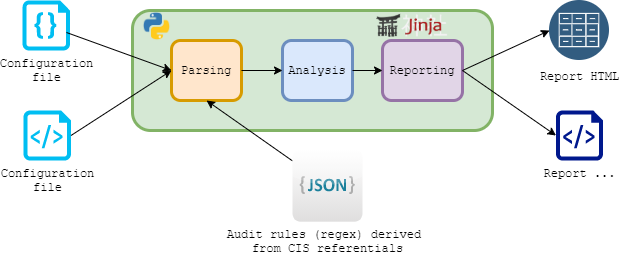

- [Objective](#objective)
- [Design overview](#design-overview)
- [Requirement](#requirement)
- [Folder layout](#folder-layout)
- [Debug mode](#debug-mode)
- [Release policy](#release-policy)
- [Global convention](#global-convention)
- [Rules configuration convention](#rules-configuration-convention)
- [IDE](#ide)
- [Communication betwen modules](#communication-betwen-modules)
- [Transfer objects structure](#transfer-objects-structure)
- [Code security and quality](#code-security-and-quality)

# Objective

The tools has for objective to perform a fully automated secure configuration review using the [CIS](https://www.cisecurity.org/cis-benchmarks/) referential for the following **type** of web/application server:

- Apache web server.
- Apache Tomcat.
- Microsoft IIS.

# Design overview

> Made with [Draw.io](https://app.diagrams.net/). Source file is [here](DesignOverview.drawio).




# Requirements

- Python 3.7+.
- Configuration files of the target to analyse.
- Windows, Linux or MAC machine: Compatibility tested via the [audit CI job](https://github.com/ExcelliumSA/WebServerSecureConfigurationReviewAutomationTool/actions).

# Folder layout

```text
PROJECT_ROOT
├───.vscode
├───analysis
├───ci
├───common
├───documentation
├───parsing
├───references
├───reporting
├───templates
├───tests
```

:construction: Python project related content:

- **analysis**: Package containing all Python code related to the analysis of the configuration file provided.
- **common**: Package containing all Python code shared by all the project.
- **parsing**: Package containing all Python code related to the parsing of the the references audit rules and the configuration file provided.
- **references**: Folder containing the audit rules files for every technology supported.
- **reporting**: Package containing all Python code related to the generation of the report.
- **templates**: Report template file using the JINJA syntax to define the available reports.
- **tests**: Package containing all Python code related to the unit testing of the project.

:memo: Documentation, CI, IDE related content:

- **.vscode**: Folder containing the internal stuff used by [VSCode](Architecture.md#ide) to handle the project.
- **ci**: Folder containing all the Continuous Integration files used by [GitHub actions workflows](../.github/workflows).
- **documentation**: Folder containing all the projects documentation files (markdown, images, etc).

:dart: The tool entry point is the `main.py` file:

```bash
python main.py --help
```

# Debug mode

By default the tool do not print the debug level message.

To enable the debug mode then set a environement variable named `DEBUG` to any value prior to call the tool:

```powershell
PS> $env:DEBUG=1
```

```bash
$ export DEBUG=1
```

# Release policy

:triangular_flag_on_post: Need to be validated by our TL and the top management.

- Project and content related will not be published and will stay a full IP of Excellium Luxembourg SA due to the time/money invested by XLM on this project.
- The reason is that we have not found any free or open source tool doing this job and the commercial tool from the CIS do not support the elements covered by the tool, therefore, it will allow us to deliver the associated WP more faster and then obtain an advantage against our competitor.

# Global convention

- Usage of `requirements.txt` for dependencies.
- No oneliner except for a restricted use case.
- Snake case.
- Focus on code easy to read, understand and maintain.
- Keep the content of each file coherent with the purpose of the file (ex: no analysis in the report module).
- [Naming convention used](https://visualgit.readthedocs.io/en/latest/pages/naming_convention.html).
- In case of no result for a list then return a empty list instead of `None`.

# Rules configuration convention

Rules for each type of server are stored in JSON files which are named `nameOfTheTechnology.json` (all lowercase):

```json
[
    {   
        "rule_id": "CIS-ID" ,
        "CIS_version": "x.x",
        "audit_expressions": [{
                        "expression":"*RULE_REGEX*",
                        "presence_needed": "True|False"
                        },
                        ...
                    ],
        "override_rules": [{
                "rule_id": "CIS-ID",
                "CIS_version": "x.x"
                },
                ...
            ]
    }
]
```

The member **rule_id** have the following value `CIS-PointIdentifierInReferential`.

*Example:* For the point 2.4 of the CIS then the member **rule_id** will be `CIS-2.4`.

The member **CIS_Version** have the following value `uppercase(TechnologyName)-TechnologyVersion-CISDocumentVersion`.

*Example:* The document of the CIS is named `CIS_Apache_HTTP_Server_2.4_Benchmark_v1.5.0.pdf` so the member **CIS_Version** will be `APACHE-2.4-1.5.0`.

The member **presence_needed** is used to specify if the audit expression (regex) is expected to find something or not:

- If *True* then the validation is considered failed if the audit expression find something.
- If *False* then the validation is considered failed if the audit expression find nothing.

The member **override_rules** is used to indicate that the current rule override, in terms of validation, the list of rules specified. This information is used during the reporting phase.

# IDE

- [Visual Studio Code](https://code.visualstudio.com/) with [Python extension provided by Microsoft](https://marketplace.visualstudio.com/items?itemName=ms-python.python).
- Project workspace file has been configured to trigger the installation of required code analysis modules and analysis profile is defined in the workspace settings area.
- Define the folliwng Pre-Commit hook in the file `[PROJECT_HOME]/.git/hooks/pre-commit`:

```bash
#!/bin/sh
echo "[+] Ensure that all Unit Tests pass before to accept a commit..."
pytest
rc=$?
if [ $rc == 0 ]
then
	echo "[+] All UT pass - Commit accepted."
else
	echo "[!] NOT All UT pass - Commit refused."
fi
exit $rc
```

# Communication betwen modules

## Module Parsing

Read the configuration files provided via a folder and create a collection of `ConfigData` object instances.

## Module Analysis

Use the collection of the `ConfigData` object instances received to apply **analysis rules** (based on Regex) against them in order to identify issues and create a collection of `AnalysisData` object instances.

## Module Reporting

Aggregate the parsing and analysis information in a `ReportData` object instance and use this object to generate a report in the wanted format.

# Transfer objects structure

> ID of the analysis rule is the CIS rule ID.

ConfigData:

- Type of web/application server.
- A string with the configuration elements to analyse (content of the config file).
- Source file name containing the configuration elements.
- List of validation rules to apply.

AnalysisData:

- Type of web/application server.
- List of `IssueData` object instances.
- Source file name containing the configuration elements affected by the issues.

IssueData:

- Details of issue (string).
- ID of the rule.
- Version of CIS.

AuditRule:

- ID of the rule.
- Version of the CIS.
- The list of the regular expressions to test.
- The list of rule that this rule override.

OverrideRule:

- ID of the rule.
- Version of the CIS.

ReportData:

- Data generated by the parser for a configuration file.
- Data generated by the analyzer for a configuration file.

# Code security and quality

- [PyTest](https://www.guru99.com/pytest-tutorial.html) is used for the unit testing and all main processing **are** covered by a UT suite.
- Every analysis rule is covered by a positive and negative unit test, however, the tests are factored in order to tests only rules of type of server (made the maintenance more easier).
- Third-party dependencies are tracked by [Dependabot](https://dependabot.com/).
- Code is analyzed with [Bandit](https://pypi.org/project/bandit/), [Flake8](https://flake8.pycqa.org/en/latest/) and [Pydocstyle](https://pypi.org/project/pydocstyle/). See this [section](Architecture.md#ide) for details regarding the integration of these tools into the IDE.
