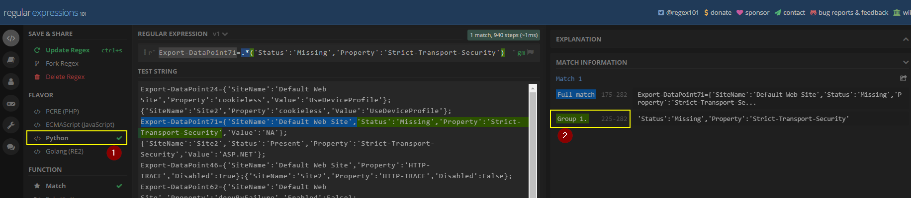

# TOC

- [Add support for a new app server](#Add-support-for-a-new-app-server)
- [Add a new audit rule](#add-a-new-audit-rule)
- [Add a new report template](#add-a-new-report-template)
- [Extract input data for IIS](#extract-input-data-for-iis)

# Add support for a new app server

Follow these steps.

**Step 1:**

Add a new audit rules JSON file in this [folder](../references) and follow this [naming convention](Architecture.md#rules-configuration-convention).

Ex: `apache.json`

**Step 2:**

Add the technology to this [enumeration](../common/server_type.py) and use the uppercase name for the technology for the enum name of the new item (continue the integer sequence for the value of the new item).

Ex: `APACHE`

**Step 3:**

Add new dedicated parsing function in [this](../parsing/parser.py) module using this name and signature: `def parse_config_data_[technology_lowercase](config_file_name, audit_rules)`

Ex: `parse_config_data_apache(config_file_name, audit_rules)`

:warning: This parsing function must return a **[ConfigData](../common/config_data.py)** object.

**Step 4:**

Add a new condition to this block of the [main](../main.py#L36) for the new technology added.

# Add a new audit rule

> A **audit rule** is based on one or several [regular expressions](https://www.rexegg.com/regex-quickstart.html).

## File information for the different supported technology

### Apache

- **Reference audit rules**: Audit rules are defined in this [file](../references/apache.json).
- **Triggering test config**: Test configuration snippet that **trigger all the rules** are defined in this [file](../tests/data/apache_test_config_all_issues.conf).
- **No triggering test config**: Test configuration snippet that **trigger NO rules** are defined in this [file](../tests/data/apache_test_config_no_issue.conf).

### Tomcat

- **Reference audit rules**: Audit rules are defined in this [file](../references/tomcat.json).
- **Triggering test config**: Test configuration snippet that **trigger all the rules** are defined in this [file](../tests/data/tomcat_test_config_all_issues.xml).
- **No triggering test config**: Test configuration snippet that **trigger NO rules** are defined in this [file](../tests/data/tomcat_test_config_no_issue.xml).

### IIS

- **Reference audit rules**: Audit rules are defined in this [file](../references/iis.json).
- **Triggering test config**: Test configuration snippet that **trigger all the rules** are defined in this [file](../tests/data/iis_test_config_all_issues.json).
- **No triggering test config**: Test configuration snippet that **trigger NO rules** are defined in this [file](../tests/data/iis_test_config_no_issue.json).

## Procedure

Follow these steps.

**Step 1:**

Add a new rule block in the **reference audit rules** following this [naming convention](Architecture.md#rules-configuration-convention).

**Step 2:**

Add a configuraton snippet in the **triggering test config** that **will trigger** the rule added.

:warning: Add comment above the snippet in order to specify the CIS point to which the rule refer.

:warning: Perform this for all regex expression added for a rule!

**Step 3:**

Add a configuraton snippet in the **no triggering test config** that **will NOT trigger** the rule added.

:warning: Add comment above the snippet in order to specify the CIS point to which the rule refer.

:warning: Perform this for all regex expression added for a rule!

**Step 4:**

Run the following command line to ensure that your configuration is valid:

```shell
$ pytest
```

:white_check_mark: If all unit tests pass then your new rule is correctly added.

## Rule development sandbox

> This helper [site](https://www.debuggex.com/) can be used to debug a regex.

The following python script can be used to test a audit rule (regex), for example, once it was created using a helper site like [regex101.com](https://regex101.com/):

Script:

```python
import re, sys
# Take regex to test as parameter
current_regex = sys.argv[1]
# Read the configruation against which the regex must be tested
with open("test-configuration.txt","r") as f:
	content = f.read()
# Display the regex received and that will be applied
print(f"[+] Regex:\n{current_regex}")
# Apply the regex using the same code than the tools
pattern = re.compile(current_regex, re.DOTALL | re.MULTILINE)
identified = pattern.findall(content)
# Display results found
print("[+] findall() results:")
print(identified)
```

Usage example:

```shell
$ python test.py "Export-DataPoint71=.*('Status':'Missing','Property':'Strict-Transport-Security')"
[+] Regex:
Export-DataPoint71=.*('Status':'Missing','Property':'Strict-Transport-Security')
[+] findall() results:
["'Status':'Missing','Property':'Strict-Transport-Security'"]         
```

Regarding [regex101.com](https://regex101.com/), take care to the following elements:



Point **1**: Set the **FLAVOR** flag to **Python**.

Point **2**: All **Group** matches will be captured by the tool.

# Add a new report template

> Template use the JINJA template engine, the syntax is available [here](https://jinja.palletsprojects.com/en/2.11.x/templates/).

> Each template receive an instance of the object [ReportData](../common/report_data.py) in its context at runtime under the variable named `data` in order to give it data to render.
 
> A reference to the package `os.path` under the variable named `util_file` is passed in order to allow the report to work with filename in case of need.

> A reference to the function `datetime.datetime.now()` under the variable named `util_date` is passed in order to allow the report to work with current date/time in case of need.

:warning: All templates must have the extension `.txt`

:warning: A template must not depend on any external resources (like online one in case of HTML report for example) because it must allow the client to open it from a network isolated from Internet. Due to this, all needed resource must be embedded in the template itself.

:information_source: Report [example](../templates/template_html.txt).

Add a new text file in the folder [templates](../templates) with this naming convention `template_[identifier].txt` where `identifier` is a word that indicate the format and a qualifier for the type of report.

Syntax expected for the `identifier` is `[a-z0-9_]{1,20}`.

# Extract input data for IIS

> :white_check_mark: No sensitive data is extracted and only read operations are performed.

> :warning: **It is important that the client ensure that the JSON file do not contains any sensitive data prior to send the file to XLM!**

> :warning: The script must be executed with a user having local admin rights.

A dedicated PowerShell script was created in order to allow a client to extract the data without the help of XLM.

The script is [here](../references/export-iis-config.ps1) and generate a JSON file.

The following paragraph describe how to use it from a PowerShell shell window.

```powershell
PS> .\export-iis-config.ps1
[+] Verify that the current user 'XLM' have local admin rights...
[+] Verify the installed roles...
[+] Gathering information: Finished with 0 error(s).
[+] Generate and save the JSON file...
[+] Content saved to file LABWIN2019-IIS.json.
[+] File SHA256 hash:
A2DF20F445F68183CA029940A2D3DFB1FE89EDDAE5B2DCF991315865306D6153
```

:warning: If the current did not have the local admin rights then the following message is displayed:

```powershell
PS> .\export-iis-config.ps1
[+] Verify that the current user 'XLM' have local admin rights...
The user did not have the local admin rights, extraction cancelled!
```

:warning: If IIS is not installed on the machine then the following message is displayed:

```powershell
PS> .\export-iis-config.ps1
[+] Verify that the current user 'XLM' as local admin rights...
[+] Verify the installed roles...
The IIS roles 'Web-Server' and 'Web-WebServer' are not installed, extraction cancelled!
```

Once the JSON is generated, it must be provided to XLM (with its hash) and will be used as input source for the review tool.

:pushpin: **Compatibility matrix**

> Table generated using this [site](https://www.tablesgenerator.com/markdown_tables).

|    Windows   |  IIS |      Testing      |       Supported         |
|:------------:|:----:|:-----------------:|:-----------------------:|
| 2003         | 6.0  | Not tested        | :x:                     |
| 2008         | 7.0  | Not tested        | :x:                     |
| 2008         | 7.5  | Not tested        | :x:                     |
| 2012         | 8.0  | Not tested        | :x:                     |
| 2012         | 8.5  | Manually          | :heavy_check_mark:      |
| 2016         | 10.0 | Continuous via GH | :heavy_check_mark:      |
| 2019         | 10.0 | Continuous via GH | :heavy_check_mark:      |

Regarding *Continuous via GH*, see [here](https://github.com/ExcelliumSA/WebServerSecureConfigurationReviewAutomationTool/actions?query=workflow%3Atest_iis_config_extraction).
